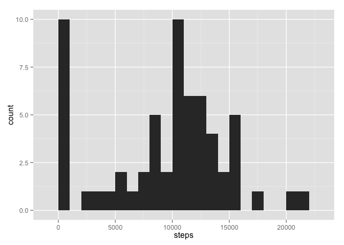
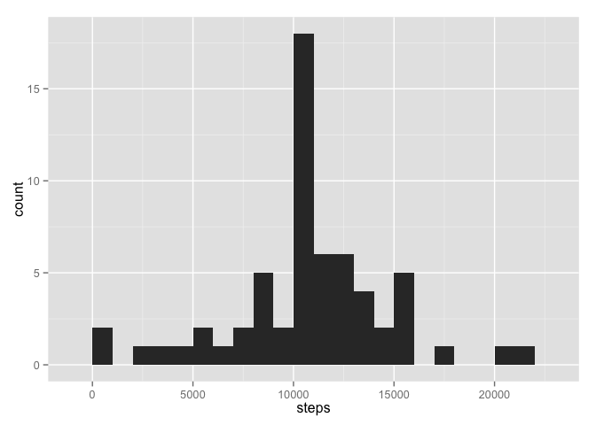
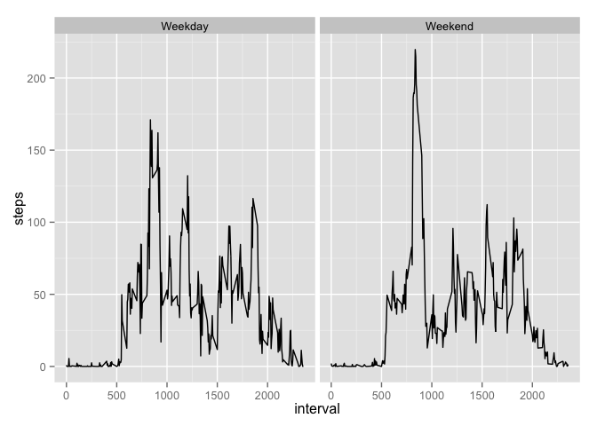

# Reproducible Research: Peer Assessment 1

```r
library(ggplot2)
```

## Loading and preprocessing the data


```r
if(!file.exists('data/activity.csv')){
    unzip('activity.zip', exdir = "./data")
}

activity.data <- read.csv("./data/activity.csv") # Load Activity Data
activity.data$date <- as.Date(activity.data$date, "%Y-%m-%d") # Set date format
## activity.data$date <- as.POSIXct(activity.data$date) #
```

## What is mean total number of steps taken per day?

Create a data frame that give the sum of steps taken per day.  

```r
spd <- with(activity.data, {
    df <- aggregate(steps, list(date), sum, na.rm=TRUE)
    names(df) <- c("date", "steps")
    return(df)
})
```

**Fig 1:** Histogram of steps taken by day.

```r
qplot(steps, data=spd, geom="histogram", binwidth=1000)
```

 

Average number of steps per day   

```r
mean(spd$steps)
```

```
## [1] 9354.23
```

Median number of steps per day  

```r
median(spd$steps)
```

```
## [1] 10395
```

## What is the average daily activity pattern?

Generate a data frame that contains the average number of Steps by Interval(sbi)  

```r
sbi <- with(activity.data, {
    df <- aggregate(steps, list(interval), mean, na.rm=TRUE)
    names(df) <- c("interval", "steps")
    return(df)
})
```

**Fig 2**: Line plot that shows the average number of steps taken each day.  

```r
ggplot(sbi, aes(interval, steps)) + geom_line()
```

 

**Which 5-minute interval, on average across all the days in the dataset,
contains the maximum number of steps?**


```r
sbi$interval[which.max(sbi$steps)]
```

```
## [1] 835
```

## Imputing missing values

Amount of missing data  

```r
nrow(subset(activity.data, is.na(steps)))
```

```
## [1] 2304
```

Create a new data frame by filling in the missing steps with the mean steps by
interval  

```r
activity.data.clean <- with(activity.data, {
    df <- activity.data
    df$steps[is.na(steps)] <- tapply(steps, interval, mean, na.rm = TRUE)
    return(df)
})
```


```r
spd.clean <- with(activity.data.clean, {
    df <- aggregate(steps, list(date), sum, na.rm=TRUE)
    names(df) <- c("date", "steps")
    return(df)
})
```

**Fig 3:** Histogram of steps taken by day using the clean activity data set.

```r
qplot(steps, data=spd.clean, geom="histogram", binwidth=1000)
```

 

Average number of steps per day  

```r
mean(spd.clean$steps)
```

```
## [1] 10766.19
```

Median number of steps per day  

```r
median(spd.clean$steps)
```

```
## [1] 10766.19
```

By replacing the missing data with the mean of that interval, you can see that
the results are noticeably different.

## Are there differences in activity patterns between weekdays and weekends?

Using the clean data split the activity up into a new data frame that displays
the average number of steps for days that fall on the weekend or the weekday.


```r
# Flag each given date as a weekend or weekday.
activity.data.clean$weekday <- with(activity.data.clean, {
    as.factor(ifelse(weekdays(as.POSIXct(date)) %in% 
                         c("Saturday","Sunday"), 'Weekday', 'Weekend')) 
})

# Create a new dataframe that displays the mean fo each interval grouped by
# weekday and weekend
aws <- with(activity.data.clean, {
    df <- aggregate(steps , list(interval, weekday), mean)
    names(df) <- c("interval","weekday","steps")
    return(df)
})
```

**Fig 4:** Side by side plot showing the differences between weekdays and 
weekends  

```r
ggplot(aws, aes(interval, steps)) + facet_grid(. ~ weekday) + geom_line()
```

 
